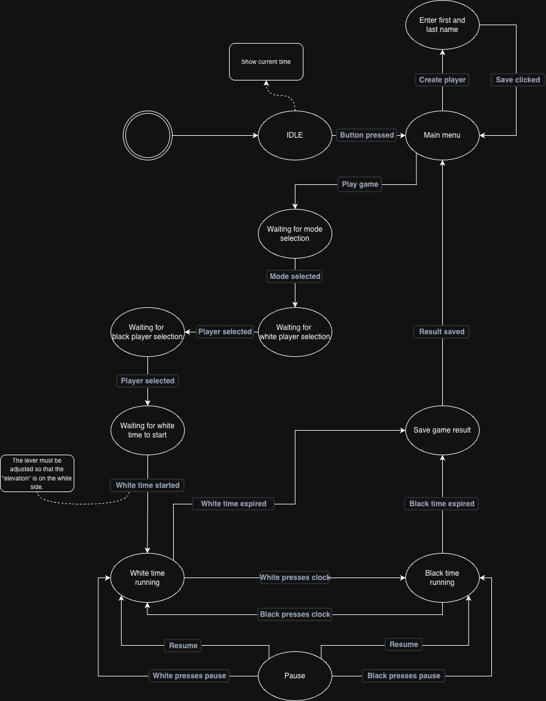

# Chess clock

This repository contains the software, including a guide for the hardware, for a self-designed and custom-built chess clock.

## ⚡️ Features
- Displays time in idle mode.
- Create and select players for games.
- Choose from different game modes.
- Stores game results.

## 🏗️ Architecture

This project uses the **MVP (Model-View-Presenter)** pattern to separate concerns and improve maintainability. This architecture provides a separation between business logic, UI rendering, and user input handling.

### MVP Architecture Overview

```
                    ┌─────────────────────────────────────┐
                    │      main.cpp (Orchestrator)        │
                    │   - Initializes MVP components      │
                    │   - Main loop coordination          │
                    └─────────────────────────────────────┘
                                  │
                    ┌─────────────┼─────────────┐
                    │             │             │
                    ▼             ▼             ▼
        ┌─────────────────┐ ┌──────────────┐ ┌──────────────┐
        │     MODEL        │ │  PRESENTER    │ │     VIEW     │
        │                  │ │               │ │              │
        │ • State Machine  │ │ • Input       │ │ • Display    │
        │ • Timer Logic    │ │   Handling    │ │   Rendering  │
        │ • Game Data      │ │ • State       │ │ • UI         │
        │ • Game Rules     │ │   Transitions │ │   Components │
        │                  │ │ • Coordinates │ │              │
        │ (Business Logic)│ │   Model↔View  │ │ (Presentation)│
        └─────────────────┘ └──────────────┘ └──────────────┘
                │                   │                 │
                └───────────────────┴─────────────────┘
                            (No direct coupling)
```

### Component Responsibilities

#### **Model Layer** (`src/model/`)
- Contains all business logic and data
- State Machine: Manages game states and transitions
- Timer: Handles time management for both players
- Game Data: Stores player information and game state
- **No UI dependencies** - can be tested independently

#### **View Layer** (`src/view/`)
- Handles all display rendering
- UI components for different states (idle, menu, game)
- Display initialization and management
- **No business logic** - only presentation

#### **Presenter Layer** (`src/presenter/`)
- Coordinates between Model and View
- Handles user input (buttons, rotary encoder)
- Manages state transitions
- Updates View when Model changes
- **The glue** that connects everything

### Data Flow

```
User Input → Presenter → Model (State Change) → Presenter → View (Update Display)
     ↑                                                              │
     └──────────────────────────────────────────────────────────────┘
                    (User sees updated display)
```

## 🔄 State Machine

The chess clock operates using a state machine to manage the different phases of a game.



## 💻 Contributors

## ⚠️ License
